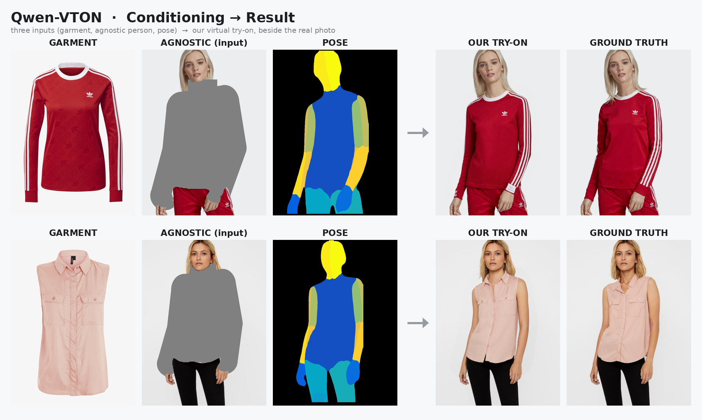
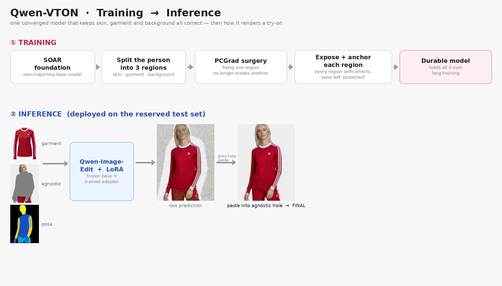

# Qwen-VTON — stable long-form virtual try-on

A single model that dresses a person in a new garment from a flat product photo — and, unlike our earlier runs, keeps **skin, garment, and background all correct at the same time, over long training.**

Built on **Qwen-Image-Edit** (frozen) with a trained LoRA adapter, on the VITON-HD benchmark.

---

## Result



Three inputs — the **garment**, the **agnostic** person (original with the clothing region blanked out), and a **pose** map — go in; our try-on comes out, shown beside the real photo. The garment identity (the Adidas stripes and trefoil, the pink shirt's collar and pockets) is reproduced, skin and background stay clean, and the result tracks the ground truth.

---

## How it was trained



The whole project was a fight against one failure mode: **whichever region we didn't actively protect would slowly rot** — fix the garment and the skin darkens; fix the skin and the garment falls apart. Getting all three to hold at once is the contribution.

**The path, in order:**

1. **SOAR foundation.** Instead of training on forward-noised ground truth (a state the model never sees at test time), train on the model's *own* multi-step rollout, then steer that back to the clean image. This is what lets the model fix its deploy-time artifacts instead of being blind to them.

2. **Split the person into three regions** — skin, garment, background — each with its own clean objective pulling to the right target. No "loss soup" where everything fights everything.

3. **PCGrad gradient surgery.** The three regions share one set of weights, and their gradients *conflict*. PCGrad projects out the conflicts so that **improving one region no longer damages another.** This was the single biggest fix for cross-region damage — mask-gated so the garment only writes to the garment.

4. **Expose and anchor every region.** Two ideas that came out of watching things break:
   - *Never fully "protect" a region.* A region shielded from the rollout looks perfect in the training loss but its **deployed output silently darkens and eventually collapses.** The cure is to let each region partially follow the rollout, so the model *learns to correct itself* there. We hit this on skin first, then — identically — on garment.
   - *Give each region a direct anchor.* A direct pixel-level anchor pinned into that region's gradient budget holds its structure (the garment's weave and logo, the skin's tone).

5. **Lower the learning rate for the long tail.** Once the model is converged, hammering it at the original LR destabilizes whatever region is momentarily weakest. Dropping the LR clears the late-stage crash.

The result is a **durable model**: all three regions hold together far past the point where every earlier recipe fell apart, beating both the base foundation and our previous best on garment, skin, and background alike.

---

## How inference works

The model predicts the full frame, but we only trust it **inside the edit region** (the garment + the blanked area). So the final image is a straight paste:

```
final = prediction   inside  grey_hole(agnostic)
        original     outside          (face, hair, arms, background)
```

`grey_hole` is the exact grey region of the agnostic image, dilated a few pixels — a hard paste, no feathering. That's why the identity (face/hair) is pixel-perfect: it's the real photo everywhere the model wasn't asked to change.

---

## Key ideas that made it work (the short list)

- **Train on your own trajectory, not forward-noised GT** — otherwise the model can't see, let alone fix, its deployment artifacts.
- **One coherent objective per region** — not a soup of competing losses.
- **PCGrad** — regions share weights and their gradients conflict; surgery is what stops one fix from breaking another.
- **Nothing gets fully protected** — a protected region rots at deploy time while the training loss stays clean. Expose it so it self-corrects.
- **Direct anchors beat weight-tuning** — a pixel anchor holds a region; nudging loss weights only *delays* the rot.
- **Drop the LR once converged** — long continuation at full LR tips the weakest region over.

---

## Repository

- `figures/fig1_pipeline.png` — conditioning → try-on vs ground truth (Adidas, pink shirt)
- `figures/fig2_training_to_inference.png` — the training → inference flow
- `figures/tryon/` — the five deployed try-on results and full raw|deployed|GT panels

*Base model: Qwen-Image-Edit. Benchmark: VITON-HD. Trained on a single RTX PRO 6000 Blackwell.*
