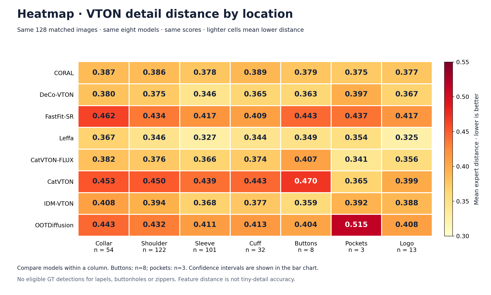
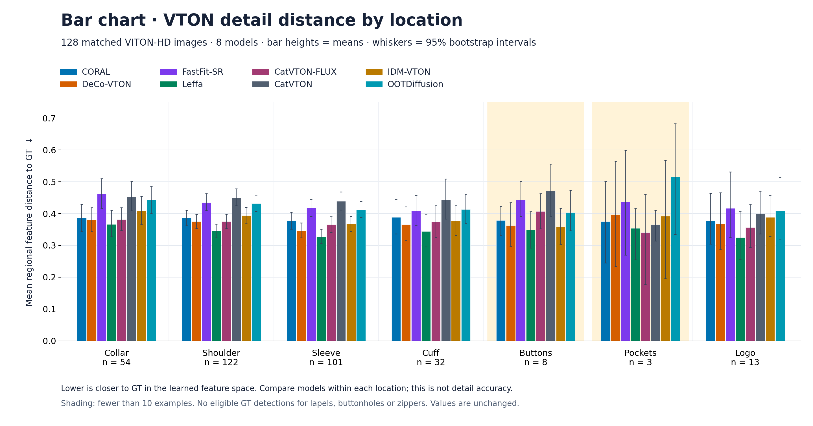
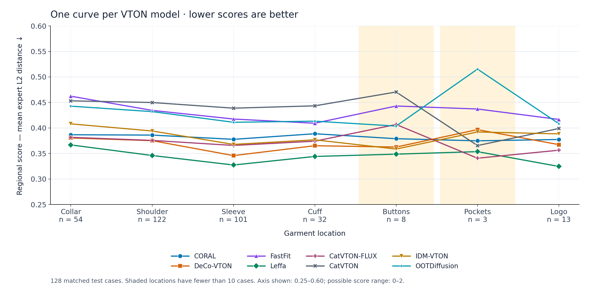
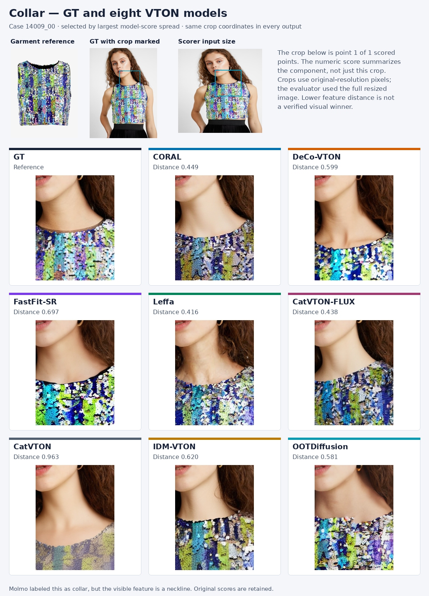
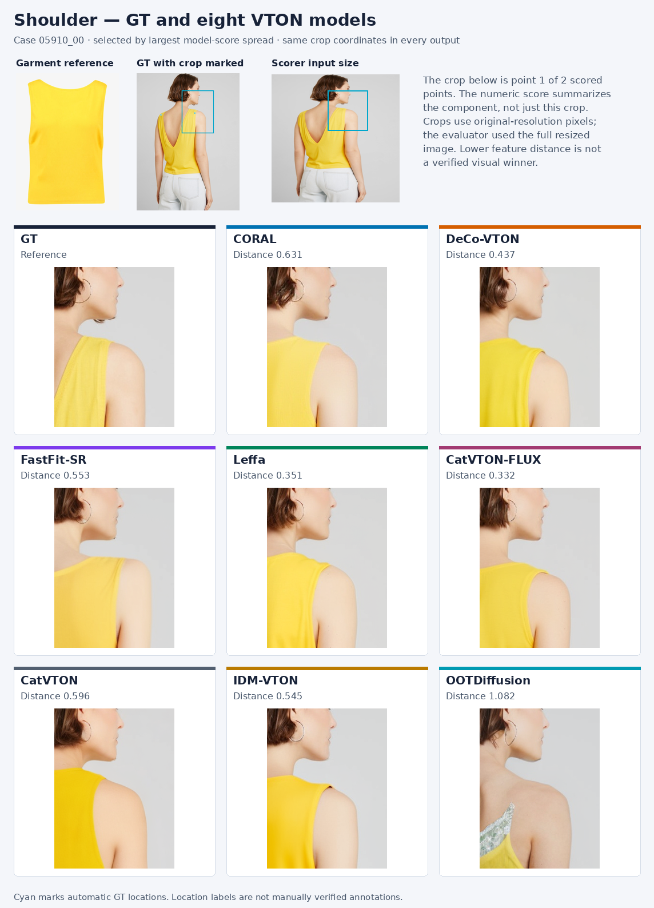
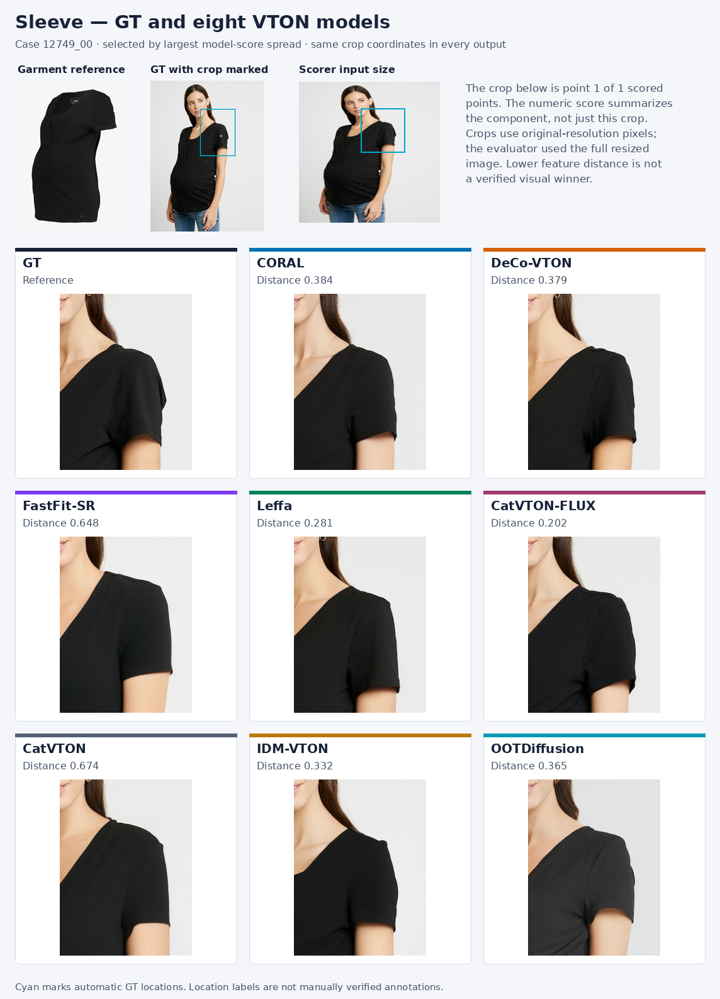
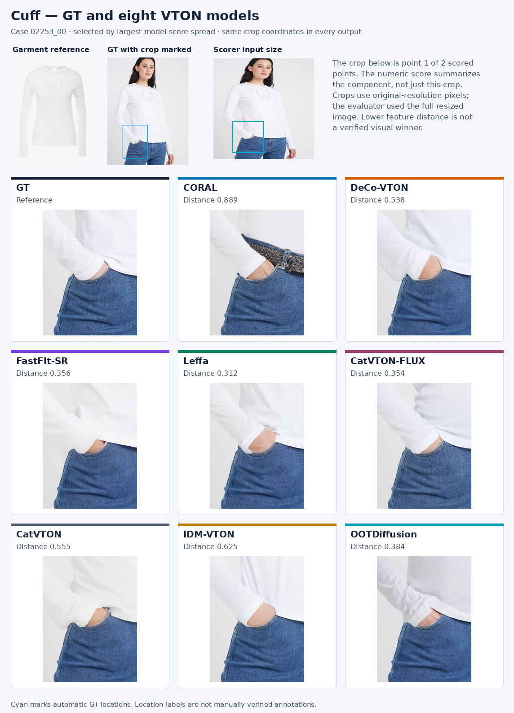
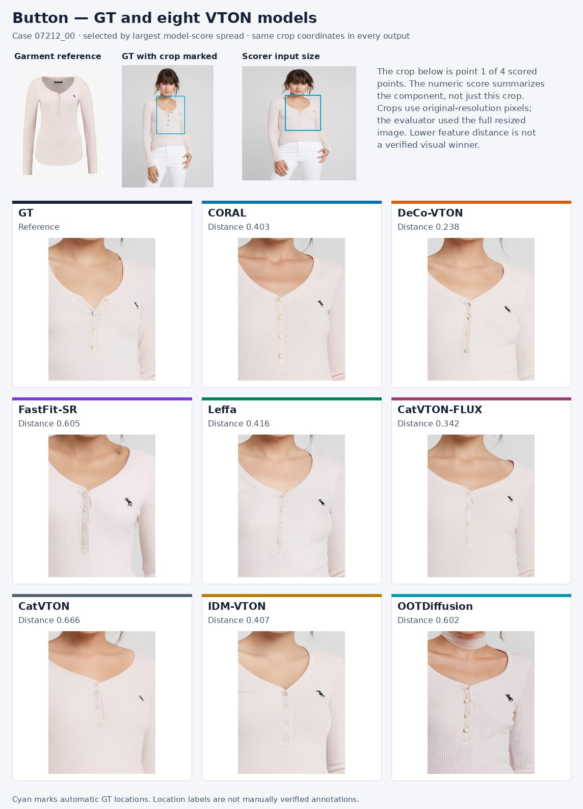
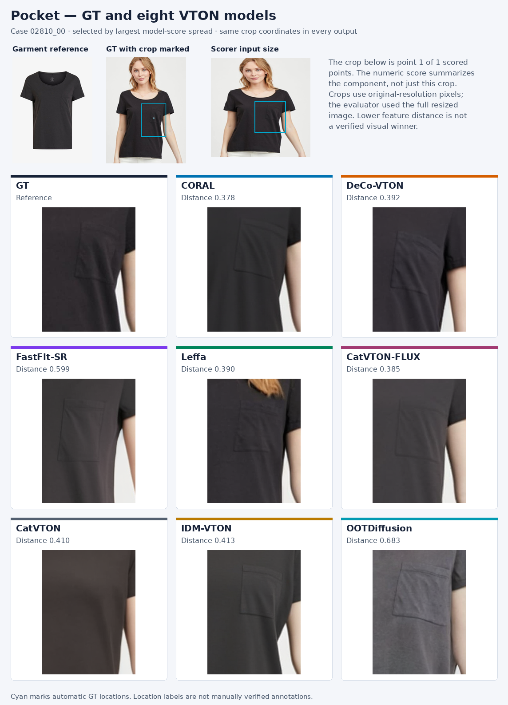
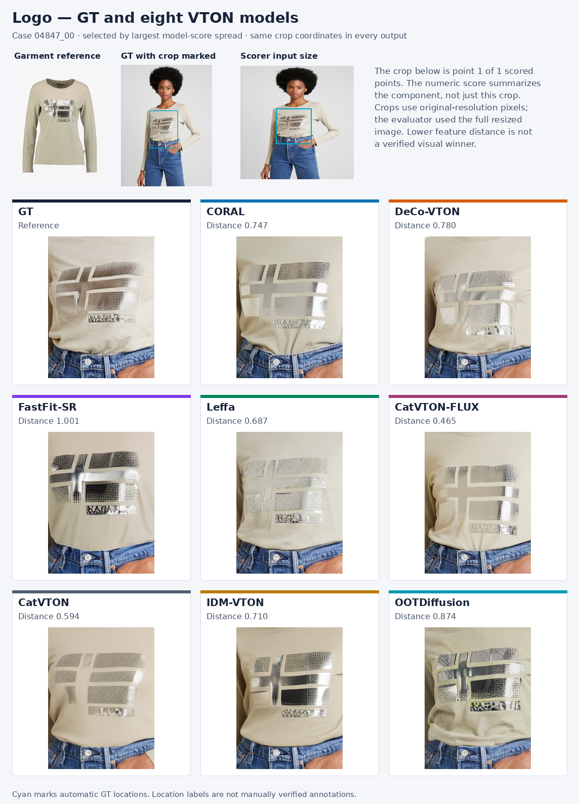

# VTON detail comparison

GT versus eight released VTON models on 128 matched VITON-HD test images. The graph and image sheets render directly on GitHub. Click an image to enlarge it.

[Training and conditioning table](model-training.md) · [Raw regional scores](scores.csv) · [Image provenance](comparison-images/manifest.json)

## Three graph options

Every view uses the same means, model order and seven measured locations. **Lower feature distance is better.** Counts are the eligible images for that component, shared by every model. No scores have been changed.

### Heatmap

Read down a column to compare the eight models at one location. Each cell prints the exact mean.

### Bar chart

Compare eight model bars within each location. Whiskers show 95% image-bootstrap intervals; the vertical axis starts at zero.

### Original line chart

The original location-versus-score chart is preserved unchanged. Lines connect category means; confidence intervals are not drawn on this view.

## Exact means

| Model | Collar (n=54) | Shoulder (n=122) | Sleeve (n=101) | Cuff (n=32) | Buttons (n=8) | Pockets (n=3) | Logo (n=13) |
|---|---:|---:|---:|---:|---:|---:|---:|
| CORAL | 0.387 | 0.386 | 0.378 | 0.389 | 0.379 | 0.375 | 0.377 |
| DeCo-VTON | 0.380 | 0.375 | 0.346 | 0.365 | 0.363 | 0.397 | 0.367 |
| FastFit-SR | 0.462 | 0.434 | 0.417 | 0.409 | 0.443 | 0.437 | 0.417 |
| Leffa | 0.367 | 0.346 | 0.327 | 0.344 | 0.349 | 0.354 | 0.325 |
| CatVTON-FLUX | 0.382 | 0.376 | 0.366 | 0.374 | 0.407 | 0.341 | 0.356 |
| CatVTON | 0.453 | 0.450 | 0.439 | 0.443 | 0.470 | 0.365 | 0.399 |
| IDM-VTON | 0.408 | 0.394 | 0.368 | 0.377 | 0.359 | 0.392 | 0.388 |
| OOTDiffusion | 0.443 | 0.432 | 0.411 | 0.413 | 0.404 | 0.515 | 0.408 |

**Limits of this result:** the scorer resizes each complete image to 224×224, then reads 5×5 windows from a 16×16 DINO grid. A full window spans about 31% of each image dimension. It was trained for retrieval; these scores have not been validated as tiny-detail accuracy. Molmo location errors can affect them. Buttons have 8 examples and pockets 3. Lapels, buttonholes and zippers have no eligible GT detections, so there are no scores for them.

## GT and generated details

These are the same seven cases selected for the original gallery, one per measured category, using the largest spread between model scores. This selection emphasizes disagreement and is not a representative random sample. Each sheet shows the garment reference, GT, the scorer’s input resolution, then GT and all eight generated crops at identical coordinates. The displayed score aggregates up to four points; the crop shows the first. No visual winner is assigned.

### Collar

Case `14009_00`. [Open full-resolution sheet](comparison-images/collar.png).

**Label issue:** Molmo called this a collar; the visible feature is a neckline. We retain the original label and scores so the existing benchmark remains auditable.

### Shoulder

Case `05910_00`. [Open full-resolution sheet](comparison-images/shoulder.png).

### Sleeve

Case `12749_00`. [Open full-resolution sheet](comparison-images/sleeve.png).

### Cuff

Case `02253_00`. [Open full-resolution sheet](comparison-images/cuff.png).

### Button

Case `07212_00`. [Open full-resolution sheet](comparison-images/button.png).

### Pocket

Case `02810_00`. [Open full-resolution sheet](comparison-images/pocket.png).

### Logo

Case `04847_00`. [Open full-resolution sheet](comparison-images/logo.png).

