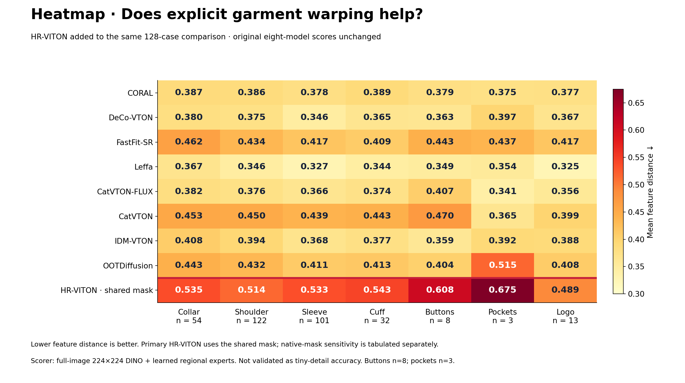
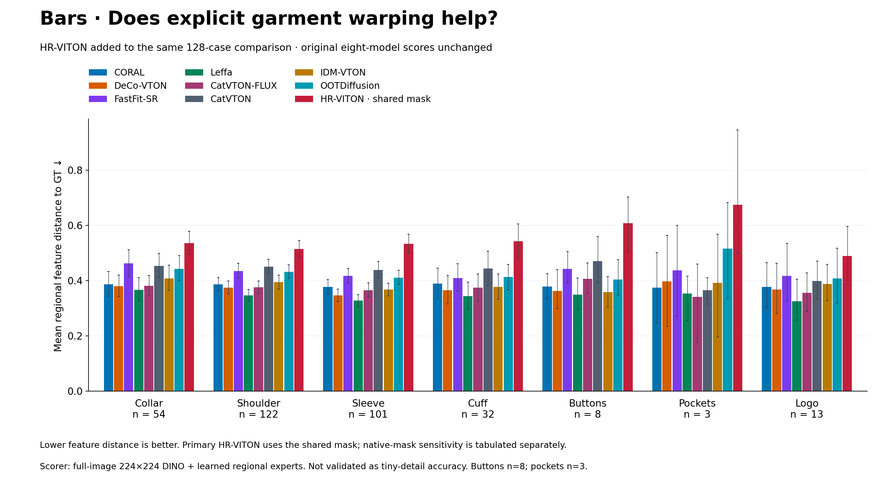
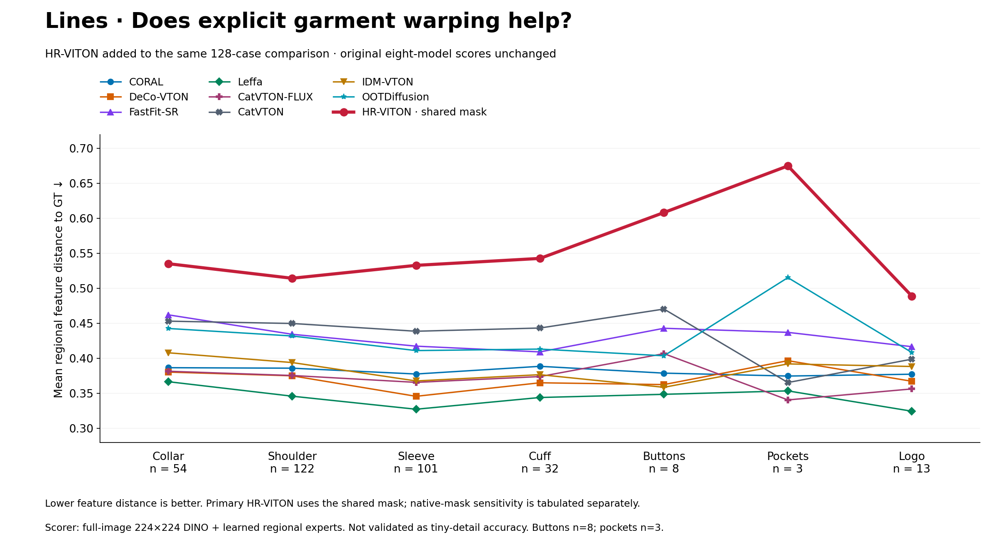
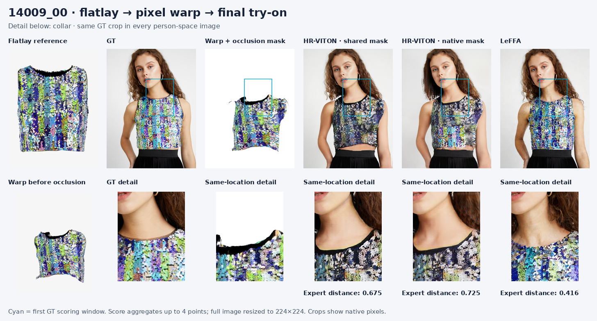
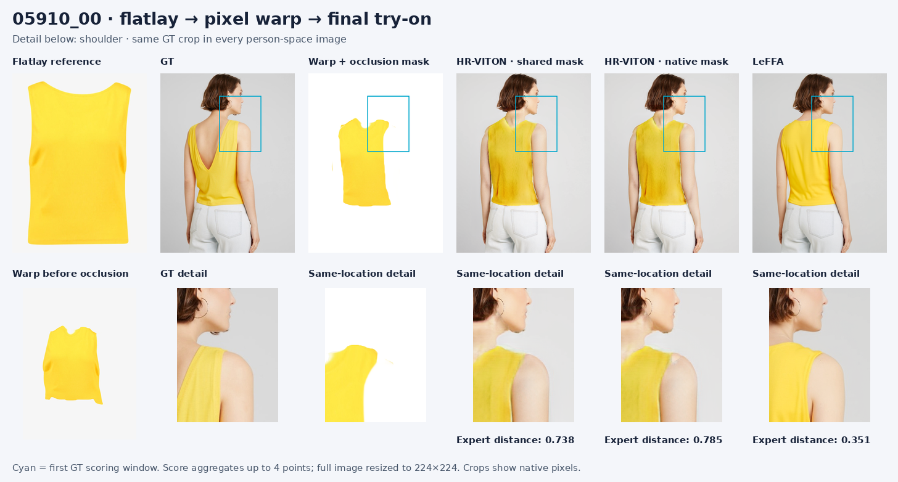
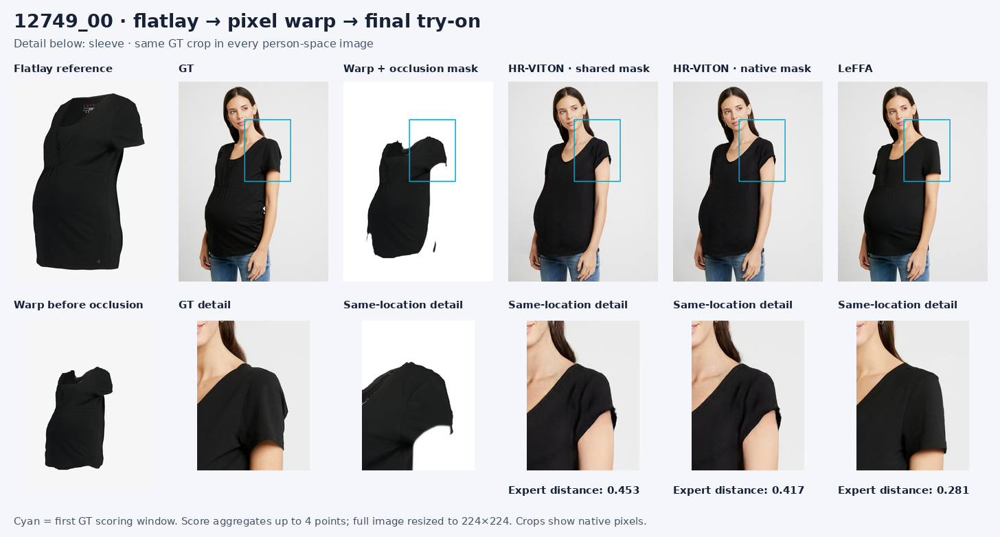
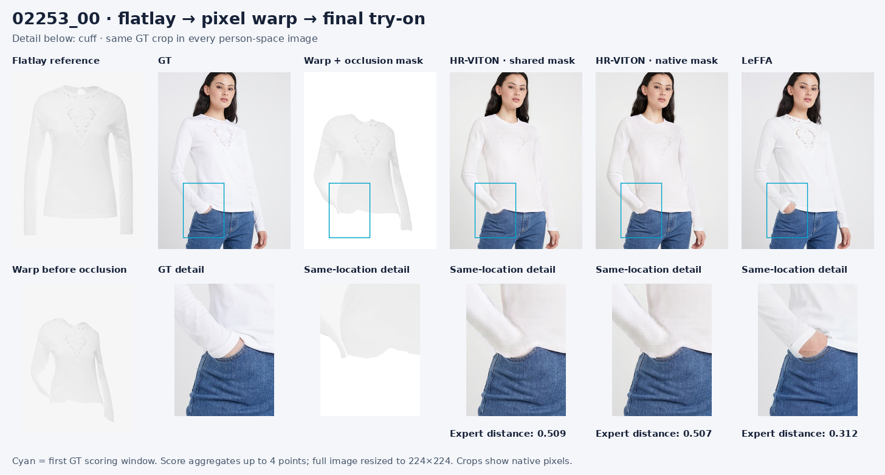
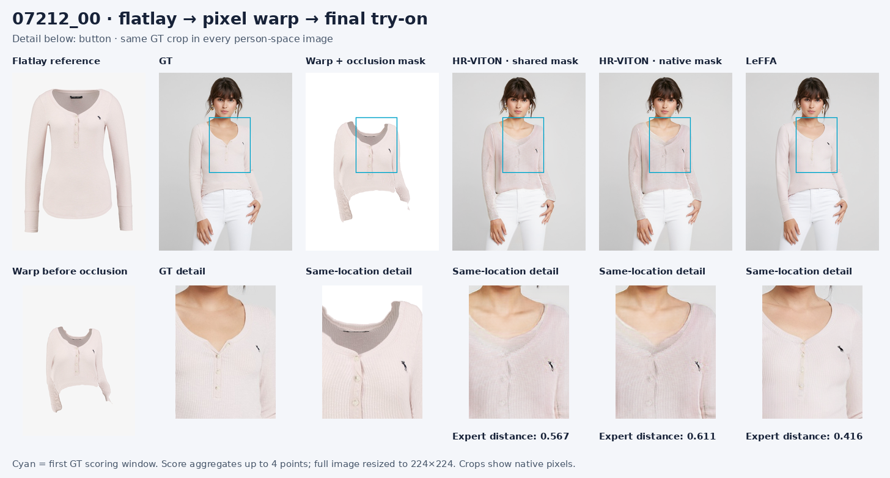
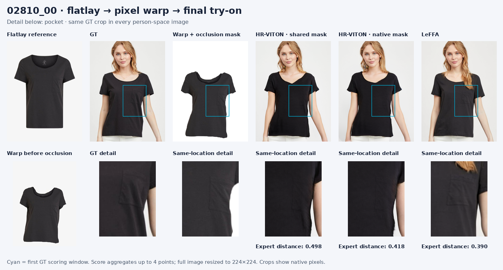
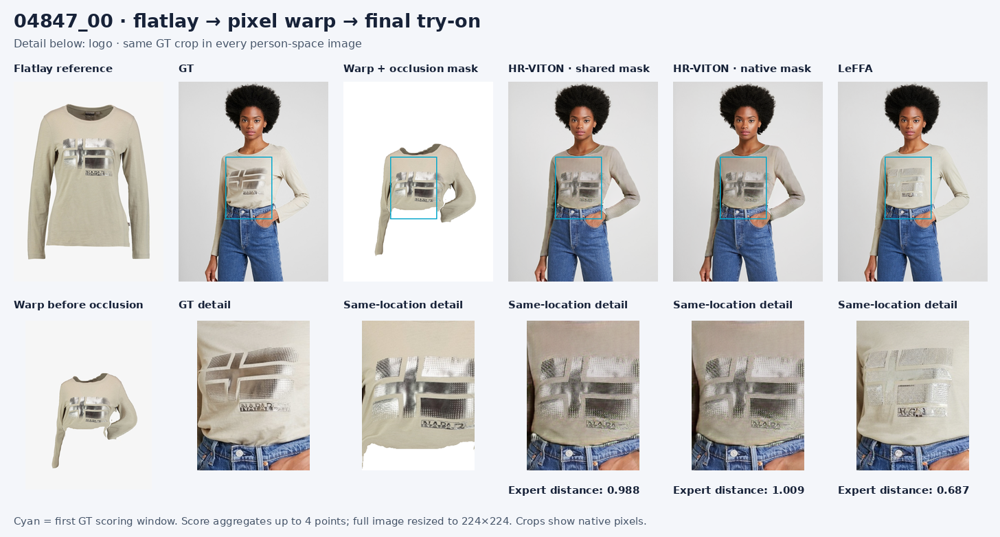

# Explicit garment warping versus the eight VTON models

HR-VITON explicitly predicts a flow field and resamples the garment pixels, then a SPADE image generator synthesizes the person wearing that warped garment. Official pretrained weights; no training performed.

[Live report](https://linkaishao.github.io/qwen_vton/warp-benchmark/) · [Inference and scoring code](../../pipelines/vton_benchmark/README.md) · [Original comparison](../region-benchmark/README.md) · [Official HR-VITON](https://github.com/sangyun884/HR-VITON) · [Run provenance](provenance.json) · [Raw scores](scores.csv)

Result: HR-VITON has higher (worse) mean expert distance than LeFFA in all seven measured regions. Native masking does not reverse this result. This older warping baseline is fast, but it does not improve the measured regional fidelity in this test.

Same 128 paired VITON-HD test cases and 1024×768 outputs. Primary HR-VITON uses the existing benchmark mask; native HR-VITON masking is a separate sensitivity check. Both retain required native parse-agnostic, cloth-mask and DensePose inputs. Original eight-model outputs and scores are unchanged.

## Heatmap

## Bar chart

## Line chart

## Exact means

| Model | Collar | Shoulder | Sleeve | Cuff | Buttons | Pockets | Logo |
|---|---:|---:|---:|---:|---:|---:|---:|
| CORAL | 0.387 | 0.386 | 0.378 | 0.389 | 0.379 | 0.375 | 0.377 |
| DeCo-VTON | 0.380 | 0.375 | 0.346 | 0.365 | 0.363 | 0.397 | 0.367 |
| FastFit-SR | 0.462 | 0.434 | 0.417 | 0.409 | 0.443 | 0.437 | 0.417 |
| Leffa | 0.367 | 0.346 | 0.327 | 0.344 | 0.349 | 0.354 | 0.325 |
| CatVTON-FLUX | 0.382 | 0.376 | 0.366 | 0.374 | 0.407 | 0.341 | 0.356 |
| CatVTON | 0.453 | 0.450 | 0.439 | 0.443 | 0.470 | 0.365 | 0.399 |
| IDM-VTON | 0.408 | 0.394 | 0.368 | 0.377 | 0.359 | 0.392 | 0.388 |
| OOTDiffusion | 0.443 | 0.432 | 0.411 | 0.413 | 0.404 | 0.515 | 0.408 |
| HR-VITON · shared mask | 0.535 | 0.514 | 0.533 | 0.543 | 0.608 | 0.675 | 0.489 |
| HR-VITON · native mask | 0.539 | 0.517 | 0.524 | 0.538 | 0.599 | 0.655 | 0.497 |

## Paired comparison with LeFFA

Negative differences favor HR-VITON. Intervals resample the same images for both models, 2,000 times.

| Region | n | HR-VITON − LeFFA | Paired 95% interval |
|---|---:|---:|---|
| Collar | 54 | +0.169 | +0.133 to +0.203 |
| Shoulder | 122 | +0.168 | +0.140 to +0.198 |
| Sleeve | 101 | +0.206 | +0.176 to +0.238 |
| Cuff | 32 | +0.199 | +0.147 to +0.248 |
| Button | 8 | +0.260 | +0.165 to +0.357 |
| Pocket | 3 | +0.321 | +0.109 to +0.691 |
| Logo | 13 | +0.164 | +0.097 to +0.231 |

## What the warp actually produced

Each sheet shows flatlay, GT, warped garment, HR-VITON with shared mask, HR-VITON with native mask, and LeFFA. The seven cases are unchanged from the original gallery; the website includes all 128 cases.

### Collar · 14009_00

### Shoulder · 05910_00

### Sleeve · 12749_00

### Cuff · 02253_00

### Button · 07212_00

### Pocket · 02810_00

### Logo · 04847_00

## Timing and validation

Measured on NVIDIA GeForce RTX 5090: median warp 0.015 s + image synthesis 0.099 s; median combined model time 0.114 s/image. Excludes loading, preprocessing, PNG writes and scoring; batch one, FP32. Peak allocated memory 3.54 GiB. H200 was unreachable; this run used the local GPU.

The local scorer reproduced four previous LeFFA score records within 0.0001 and passed identical-image checks. Checkpoint loads were strict. All 128 inference artifacts and original image hashes were verified.

## Interpretation limits

Lower is closer in the learned feature space, not an accuracy percentage. Frozen DINO experts resize each full image to 224×224 and read 5×5 windows on a 16×16 grid. This retrieval-derived scorer is not validated as tiny-detail accuracy. We reuse the original Molmo GT points; new prediction localization is not evaluated. Buttons have 8 cases and pockets 3. No eligible GT detections for lapels, buttonholes or zippers. Automatic labels are retained from the original run; its collar example 14009_00 is visibly a neckline.

This comparison tests released systems and their conditioning setups. It does not isolate geometric warping as the cause of a score difference.
